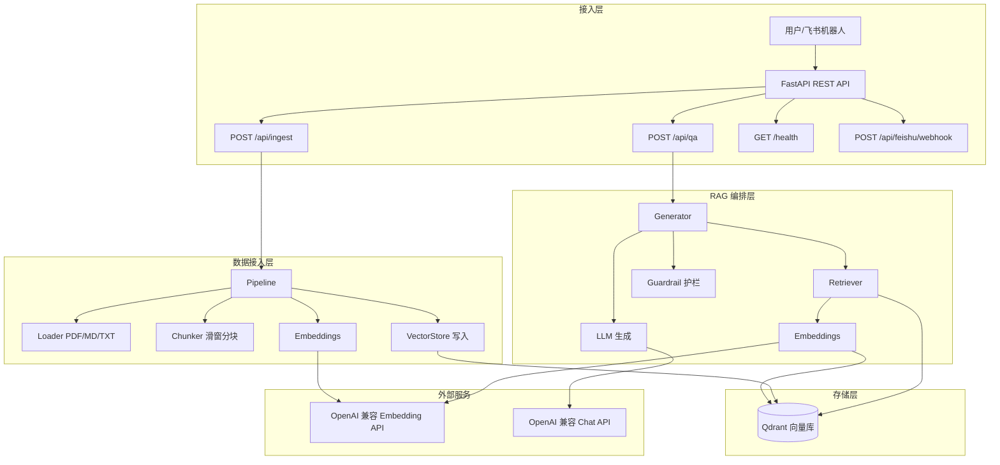
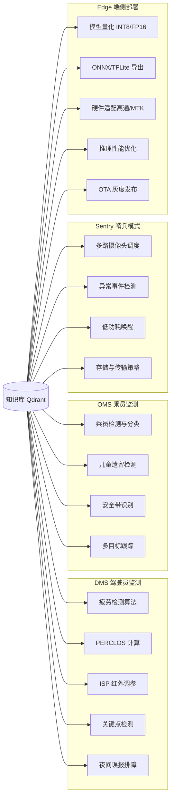
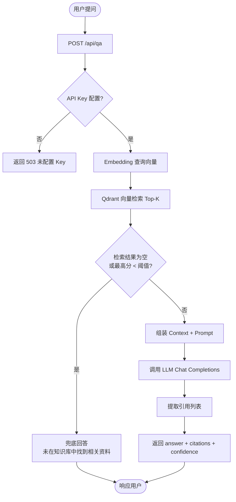
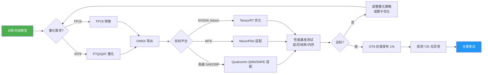

# 智能影像识别知识库 Agent 软件需求规格说明书

**版本**：v2.0 完整最终版  
**项目**：基于 RAG 的智能影像识别知识库 Agent  
**团队**：智能影像识别（DMS / OMS / 哨兵模式 / 端侧部署）  
**日期**：2024

---

## 目录

1. [业务背景](#1-业务背景)
2. [目标（G1–G11）](#2-目标g1g11)
3. [功能需求（FR）](#3-功能需求fr)
4. [非功能需求](#4-非功能需求)
5. [系统架构](#5-系统架构)
6. [知识域视图](#6-知识域视图)
7. [问答流程图](#7-问答流程图)
8. [端侧部署流程图](#8-端侧部署流程图)

---

## 1. 业务背景

智能影像识别团队聚焦四类核心项目，积累了大量工程经验和排障知识，但这些知识分散于文档、聊天记录和个人脑海，难以检索复用。

| 项目 | 全称 | 工程知识范畴 |
|------|------|-------------|
| **DMS** | Driver Monitoring System（驾驶员监测系统） | 疲劳/分心检测、PERCLOS 算法、ISP 调参、夜间红外排障、关键点检测精度 |
| **OMS** | Occupant Monitoring System（乘员监测系统） | 乘员检测与分类、儿童遗留检测、安全带识别、多目标跟踪 |
| **Sentry** | 哨兵模式（车外环境感知） | 多路摄像头调度、异常事件检测、低功耗唤醒策略、存储与传输 |
| **Edge** | 端侧模型部署 | 模型量化（INT8/FP16）、ONNX/TFLite 导出、硬件适配（高通/MTK/NVIDIA）、性能优化 |

**核心痛点**：工程师查阅内部资料耗时长（平均 30 分钟/次），新成员上手慢，知识沉淀效率低。

---

## 2. 目标（G1–G11）

### 原始目标（G1–G7）

| 编号 | 目标 | 度量标准 |
|------|------|---------|
| **G1** | 降低查资料成本 | 工程知识问答响应 ≤ 10 秒，减少人工检索时间 ≥ 60% |
| **G2** | 提升回答可信度 | 每条回答附带文档来源引用，可追溯至原始文件 |
| **G3** | 减少模型幻觉 | 无相关证据时拒绝回答，LLM 调用严格约束在证据范围内 |
| **G4** | 支撑复杂工程问题 | 支持多文档交叉检索，处理含代码/配置的技术问题 |
| **G5** | 沉淀团队知识 | 支持持续导入新文档，知识库可增量更新 |
| **G6** | 服务飞书和 Agent | 提供飞书机器人接入骨架，API 支持外部 Agent 调用 |
| **G7** | 建立质量闭环 | 提供置信度指标，支持未来人工反馈标注（roadmap） |

### 扩展目标（G8–G11）

| 编号 | 目标 | 度量标准 |
|------|------|---------|
| **G8** | 保障资料安全 | 文档不上传第三方，API Key 通过环境变量隔离，.env 不入库 |
| **G9** | 支持多轮深入 | 骨架支持会话上下文扩展（roadmap） |
| **G10** | 知识可视化 | 支持未来集成知识图谱与向量可视化（roadmap） |
| **G11** | 支撑端侧模型部署 | 覆盖量化、导出、硬件适配等端侧工程知识的问答 |

---

## 3. 功能需求（FR）

### FR-1：数据接入

| 编号 | 需求 | 优先级 |
|------|------|--------|
| FR-1.1 | 支持导入 PDF / Markdown / TXT 格式文档 | P0 |
| FR-1.2 | 调用 OpenAI 兼容接口生成文本向量（Embedding） | P0 |
| FR-1.3 | 语义分块：滑动窗口 + 重叠，目标块大小可配置 | P0 |
| FR-1.4 | 写入 Qdrant，payload 含 source_file/title/project/chunk_index/text | P0 |
| FR-1.5 | 支持按文件名或参数自动推断 project 标签 | P1 |

### FR-2：检索召回

| 编号 | 需求 | 优先级 |
|------|------|--------|
| FR-2.1 | 向量检索 Qdrant，返回 Top-K chunks 及元数据与相似度 | P0 |
| FR-2.2 | 支持按 project 字段过滤检索范围 | P1 |
| FR-2.3 | 相似度阈值可配置（默认 0.3） | P1 |

### FR-3：生成回答

| 编号 | 需求 | 优先级 |
|------|------|--------|
| FR-3.1 | POST /api/qa 接口，输入问题返回答案与引用 | P0 |
| FR-3.2 | 调 LLM（OpenAI 兼容）生成回答，System Prompt 严格约束 | P0 |
| FR-3.3 | 回答附证据引用（source_file / title / snippet） | P0 |
| FR-3.4 | 无相关证据时直接返回兜底答案，不调 LLM | P0 |

### FR-4：API 接口

| 编号 | 需求 | 优先级 |
|------|------|--------|
| FR-4.1 | FastAPI 应用，提供 /docs Swagger UI | P0 |
| FR-4.2 | GET /health：检查服务及 Qdrant 状态 | P0 |
| FR-4.3 | POST /api/qa：问答接口 | P0 |
| FR-4.4 | POST /api/ingest：触发文档导入 | P1 |

### FR-5：知识沉淀

| 编号 | 需求 | 优先级 |
|------|------|--------|
| FR-5.1 | 支持增量导入新文档（upsert 模式） | P1 |
| FR-5.2 | 每个 chunk 保留完整元数据，支持溯源 | P0 |

### FR-6：接入渠道

| 编号 | 需求 | 优先级 |
|------|------|--------|
| FR-6.1 | REST API，JSON 格式，支持外部 Agent 调用 | P0 |
| FR-6.2 | 飞书 Webhook 骨架（签名校验 + 消息转发） | P2 |

### FR-7：质量闭环

| 编号 | 需求 | 优先级 |
|------|------|--------|
| FR-7.1 | 响应包含 confidence（最高相似度代理）和 used_evidence 字段 | P1 |
| FR-7.2 | 支持未来人工反馈标注扩展（roadmap） | P3 |

### FR-8：安全权限

| 编号 | 需求 | 优先级 |
|------|------|--------|
| FR-8.1 | API Key 通过环境变量管理，.env 不入库 | P0 |
| FR-8.2 | 未配置 API Key 时给出清晰错误提示，不崩溃 | P0 |
| FR-8.3 | 未启动 Qdrant 时给出清晰错误提示，不崩溃 | P0 |

### FR-9：知识可视化（roadmap）

| 编号 | 需求 | 优先级 |
|------|------|--------|
| FR-9.1 | 知识图谱可视化界面（roadmap） | P3 |
| FR-9.2 | 向量空间可视化（roadmap） | P3 |

### FR-10：端侧模型部署

| 编号 | 需求 | 优先级 |
|------|------|--------|
| FR-10.1 | 覆盖量化（INT8/FP16）、ONNX/TFLite 导出相关工程知识 | P1 |
| FR-10.2 | 支持端侧部署相关问答（硬件适配、性能优化） | P1 |

---

## 4. 非功能需求

| 类别 | 需求 |
|------|------|
| **性能** | 问答端到端响应（含 LLM 调用）≤ 15 秒（P95） |
| **可用性** | 服务重启后知识库数据不丢失（Qdrant 持久化） |
| **可扩展性** | 模块化设计，Embedding/LLM/向量库可独立替换 |
| **安全** | API Key 环境变量隔离；文档不上传第三方 |
| **可测试性** | 纯逻辑模块不依赖外部服务，pytest 直接通过 |
| **可运维** | Docker 容器化，单命令启动；日志输出到 stdout |
| **兼容性** | Python 3.11+；支持 OpenAI / Qwen / 通义 / vLLM 等兼容端点 |

---

## 5. 系统架构

### 5.1 分层架构图



### 5.2 目录结构

```
Knowledge-Base/
├── app/
│   ├── api/          # FastAPI 路由（qa, ingest, feishu）
│   ├── rag/          # RAG 核心（embeddings, llm, retriever, generator, guardrail, prompts）
│   ├── ingestion/    # 文档导入（loader, chunker, pipeline）
│   ├── storage/      # 向量存储（vector_store）
│   └── models/       # Pydantic 模型（schemas）
├── config/           # 配置（settings.py）
├── data/docs/        # 文档目录
├── docs/             # SRS 等文档
├── scripts/          # 工具脚本（ingest.py）
└── tests/            # 纯逻辑测试
```

---

## 6. 知识域视图



---

## 7. 问答流程图



---

## 8. 端侧部署流程图


